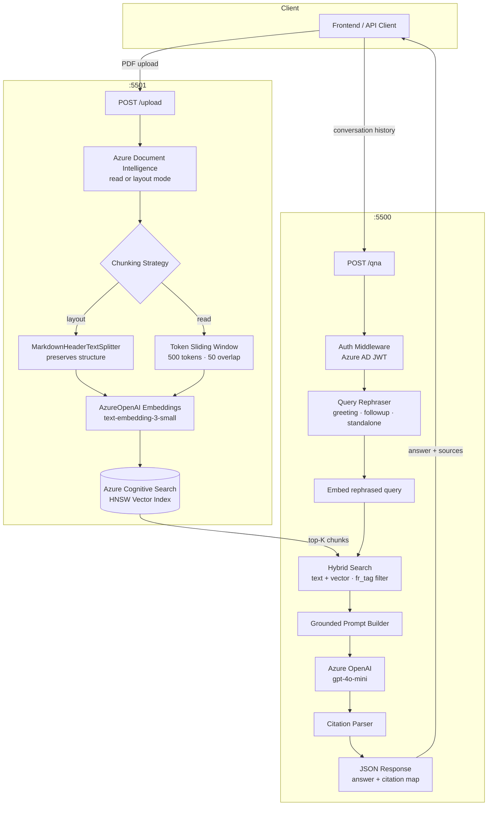

<div align="center">

# TocDoc – Enterprise RAG Assistant

**Production-grade, multi-tenant Retrieval-Augmented Generation (RAG) platform  
for intelligent document Q&A over enterprise PDF corpora.**

[](https://www.python.org/)
[](https://fastapi.tiangolo.com/)
[](https://azure.microsoft.com/en-us/products/ai-services/openai-service)
[](https://azure.microsoft.com/en-us/products/ai-services/cognitive-search)
[](LICENSE)
[](CONTRIBUTING.md)

</div>

---

## Table of Contents

- [Overview](#overview)
- [Architecture](#architecture)
- [Features](#features)
- [Tech Stack](#tech-stack)
- [Project Structure](#project-structure)
- [Prerequisites](#prerequisites)
- [Configuration](#configuration)
- [Getting Started](#getting-started)
  - [Local Development](#local-development)
  - [Docker Compose](#docker-compose)
- [API Reference](#api-reference)
  - [Ingestion Service](#ingestion-service)
  - [QnA Service](#qna-service)
- [Deployment](#deployment)
- [Known Limitations & Roadmap](#known-limitations--roadmap)
- [Contributing](#contributing)
- [License](#license)

---

## Overview

TocDoc is a production-ready RAG platform built to power **document-grounded Q&A chatbots** for enterprise environments. It ingests PDF documents into a hybrid vector search index and answers natural-language queries with **cited, grounded responses** — never hallucinating or drawing on pre-trained knowledge beyond the provided document corpus.

The system is split into two independently deployable microservices:

| Service | Responsibility |
|---|---|
| **Ingestion** | Parse PDFs → chunk → embed → index into Azure Cognitive Search |
| **QnA** | Rephrase queries → retrieve → call LLM → return cited answer |

Both services are containerized, stateless, and designed for Kubernetes-native deployment with horizontal scaling.

---

## Architecture



---

## Features

- **Dual ingestion modes** — `read` (token-chunked for dense text) and `layout` (header-split for structured documents)
- **Hybrid retrieval** — combines full-text BM25 and HNSW vector KNN search in a single query
- **Conversation-aware rephrasing** — LLM rewrites follow-up queries into self-contained, retrieval-optimized questions using up to 3 turns of history
- **Grounded, cited responses** — model is strictly constrained to the retrieved knowledge base; filenames are parsed and mapped to source paths
- **Greeting detection** — conversational turns bypass retrieval and are handled efficiently
- **Multi-tenant indexing** — every chunk is tagged with `bot_tag` for per-tenant document isolation
- **Azure Key Vault integration** — secrets loaded at startup; no secrets in application code
- **Azure AD JWT authentication** — middleware validates Bearer tokens on every QnA request
- **Kubernetes-ready** — stateless services with `/health` probes, configurable via environment variables
- **Structured logging** — all services emit structured `%(asctime)s - %(name)s - %(levelname)s` logs to stdout + rotating file

---

## Tech Stack

| Layer | Technology |
|---|---|
| API Framework | FastAPI 0.115, Uvicorn |
| LLM | Azure OpenAI (`gpt-4o-mini`) |
| Embeddings | Azure OpenAI (`text-embedding-3-small`, 1536 dims) |
| Vector Store | Azure Cognitive Search (HNSW + semantic ranker) |
| Document Parsing | Azure Document Intelligence (`prebuilt-read`, `prebuilt-layout`) |
| Secret Management | Azure Key Vault |
| Auth | Azure Active Directory (JWT RS256) |
| PDF Processing | PyMuPDF (page count), tiktoken (token chunking) |
| LangChain | `langchain-openai`, `langchain-community`, `MarkdownHeaderTextSplitter` |
| Testing | pytest, pytest-asyncio, httpx |
| Containerization | Docker, Docker Compose |

---

## Project Structure

```
TocDoc-Enterprise-RAG/
│
├── services/
│   │
│   ├── ingestion/                  # Document ingestion microservice
│   │   ├── app.py                  # FastAPI app + /upload endpoint
│   │   ├── custom_rag.py           # Core RAG class (parse · chunk · embed · index)
│   │   ├── Dockerfile
│   │   ├── requirements.txt
│   │   └── .env.example
│   │
│   └── qna/                        # Q&A microservice
│       ├── app.py                  # FastAPI app + /qna endpoint
│       ├── Dockerfile
│       ├── requirements.txt
│       ├── pytest.ini
│       ├── .env.example
│       ├── src/
│       │   ├── clients/
│       │   │   └── azure_clients.py        # AzureOpenAIHandler (lazy init)
│       │   ├── config/
│       │   │   └── config.py               # Settings, AzureConfig, LocalConfig
│       │   ├── core/
│       │   │   ├── auth.py                 # JWT middleware
│       │   │   ├── lifecycle.py            # Startup / shutdown hooks
│       │   │   └── logger.py               # Module-level logger
│       │   ├── llm/
│       │   │   └── prompts.py              # System prompts (answer + rephrasal)
│       │   ├── pipeline/
│       │   │   └── qna_pipeline.py         # End-to-end Q&A orchestration
│       │   ├── services/
│       │   │   ├── embedding_service.py    # Async embedding wrapper
│       │   │   ├── search_service.py       # Hybrid Azure Search wrapper
│       │   │   ├── openai_service.py       # Chat completion + rephrasing
│       │   │   └── text_processor.py       # Answer + citation parser
│       │   └── utils/
│       │       └── util.py                 # Pydantic models, helper functions
│       └── test/
│           └── test.py                     # pytest integration tests
│
├── docker-compose.yml              # Local dev: spin up both services
├── .env.example                    # Combined env variable reference
├── .gitignore
├── LICENSE                         # Apache 2.0
└── README.md
```

---

## Prerequisites

| Requirement | Minimum Version |
|---|---|
| Python | 3.10 |
| Docker + Docker Compose | 24.x / 2.x |
| Azure Subscription | — |
| Azure OpenAI resource | GPT-4o-mini + text-embedding-3-small deployments |
| Azure Cognitive Search | Standard tier (for vector search) |
| Azure Document Intelligence | Standard S0 (for `layout` mode) |
| Azure Key Vault | (optional — for secret rotation in production) |
| Azure AD App Registration | (required for QnA JWT authentication) |

---

## Configuration

Both services are configured entirely via environment variables. Copy the relevant `.env.example` and populate all values before running.

### Ingestion Service — `services/ingestion/.env`

| Variable | Description | Example |
|---|---|---|
| `AZURE_OPENAI_ENDPOINT` | Azure OpenAI resource endpoint | `https://my-openai.openai.azure.com/` |
| `AZURE_OPENAI_KEY` | Azure OpenAI API key | |
| `AZURE_OPENAI_VERSION` | API version | `2024-02-01` |
| `AZURE_OPENAI_EMBEDDING_MODEL` | Embedding model deployment name | `text-embedding-3-small` |
| `AZURE_SEARCH_ENDPOINT` | Azure Cognitive Search endpoint | `https://my-search.search.windows.net` |
| `AZURE_SEARCH_KEY` | Search admin key | |
| `INDEX_NAME` | Target search index name | `tocdoc-index-v1` |
| `DOC_INTELLIGENCE_ENDPOINT` | Document Intelligence endpoint | |
| `DOC_INTELLIGENCE_KEY` | Document Intelligence key | |

### QnA Service — `services/qna/.env`

| Variable | Description | Example |
|---|---|---|
| `AzureOpenaiAccountEndpoint` | Azure OpenAI endpoint | `https://my-openai.openai.azure.com/` |
| `TocdocOpenAIKey` | Azure OpenAI API key | |
| `AzureOpenaiApiVersion` | API version | `2024-02-01` |
| `AzureOpenaiLlmModel` | Chat model deployment name | `gpt-4o-mini` |
| `AZURE_OPENAI_EMBEDDING_MODEL` | Embedding model deployment name | `text-embedding-3-small` |
| `AzureSearchEndpoint` | Azure Cognitive Search endpoint | |
| `AzureSearchKey` | Search admin key | |
| `INDEX_NAME` | Search index to query | |
| `TocdocSPClientID` | Service principal client ID | |
| `TocdocSPSecretValue` | Service principal secret | |
| `TocdocSPTenantID` | Azure AD tenant ID | |
| `AZURE_KEY_VAULT` | Key Vault name (without `.vault.azure.net`) | |
| `AUDIENCE_ID` | JWT audience for token validation | |

---

## Getting Started

### Local Development

```bash
# 1. Clone the repository
git clone https://github.com/MaanavA26/TocDoc---Enterprise-RAG.git
cd TocDoc---Enterprise-RAG

# 2. Configure the Ingestion service
cp services/ingestion/.env.example services/ingestion/.env
# Edit services/ingestion/.env and fill in all Azure credentials

# 3. Configure the QnA service
cp services/qna/.env.example services/qna/.env
# Edit services/qna/.env and fill in all Azure credentials

# 4a. Run the Ingestion service
cd services/ingestion
python -m venv .venv && source .venv/bin/activate
pip install -r requirements.txt
uvicorn app:app --host 0.0.0.0 --port 5501 --reload

# 4b. Run the QnA service (in a separate terminal)
cd services/qna
python -m venv .venv && source .venv/bin/activate
pip install -r requirements.txt
uvicorn app:app --host 0.0.0.0 --port 5500 --reload
```

### Docker Compose

```bash
# Start both services
docker compose up --build

# Start in detached mode
docker compose up --build -d

# View logs
docker compose logs -f

# Stop
docker compose down
```

Services will be available at:

| Service | URL |
|---|---|
| Ingestion API docs | http://localhost:5501/upload_pipeline/docs |
| QnA API docs | http://localhost:5500/qna/docs |
| Ingestion health | http://localhost:5501/upload_pipeline/health |
| QnA health | http://localhost:5500/qna/health |

---

## API Reference

### Ingestion Service

#### `POST /upload_pipeline/upload`

Ingests a single PDF file or a server-side folder of PDFs into the Azure Cognitive Search index.

**Query Parameters**

| Parameter | Type | Required | Description |
|---|---|---|---|
| `bot_tag` | `string` | Yes | Tenant / bot identifier stored on every indexed chunk |
| `filepath` | `string` | Yes | Absolute server-side path to the file or folder |
| `fr_mode` | `string` | No | `read` (default) or `layout` |

**Form Data**

| Field | Type | Required | Description |
|---|---|---|---|
| `file` | `UploadFile` | Conditional | Required when `filepath` is a single file |

**Single-file example**

```bash
curl -X POST "http://localhost:5501/upload_pipeline/upload" \
  -F "file=@/path/to/document.pdf" \
  -G \
  --data-urlencode "bot_tag=acme-corp" \
  --data-urlencode "filepath=/data/documents/document.pdf" \
  --data-urlencode "fr_mode=layout"
```

**Response (200)**

```json
{
  "status": "successfully indexed",
  "detail": {
    "status": "successful",
    "filename": "document.pdf",
    "total_pages": 12,
    "total_chunks": 34,
    "max_token": 498,
    "min_token": 42,
    "avg_token": 312.5,
    "max_character": 1987,
    "min_character": 168,
    "avg_character": 1248.3
  }
}
```

**Folder batch example**

```bash
curl -X POST "http://localhost:5501/upload_pipeline/upload" \
  -G \
  --data-urlencode "bot_tag=acme-corp" \
  --data-urlencode "filepath=/data/documents/folder" \
  --data-urlencode "fr_mode=read"
```

---

### QnA Service

#### `POST /qna/qna`

Answers a user query grounded in the indexed document corpus. Requires a valid Azure AD Bearer token.

**Headers**

| Header | Value |
|---|---|
| `Authorization` | `Bearer <azure-ad-jwt>` |
| `Content-Type` | `application/json` |

**Request Body**

```json
{
  "session_id": "session-abc-123",
  "bot_tag": "acme-corp",
  "fr_tag": "read",
  "bot": [
    {
      "user_query": "What are the payment terms in the Q1 procurement contract?",
      "bot_response": null
    }
  ]
}
```

| Field | Type | Description |
|---|---|---|
| `session_id` | `string` | Correlation ID for the conversation session |
| `bot_tag` | `string` | Tenant / bot identifier (must match ingestion `bot_tag`) |
| `fr_tag` | `string` | Retrieval mode: `read` or `layout` (must match the ingestion `fr_mode`) |
| `bot` | `array` | Full conversation history, oldest first. Last entry is the current query. |

**Response (200)**

```json
{
  "answer": "The Q1 procurement contract specifies net-30 payment terms with a 2% early-payment discount if settled within 10 days of invoice date.",
  "citation": {
    "Q1_Procurement_Contract.pdf": "/data/documents/Q1_Procurement_Contract.pdf"
  }
}
```

**Multi-turn conversation example**

```json
{
  "session_id": "session-abc-123",
  "bot_tag": "acme-corp",
  "fr_tag": "read",
  "bot": [
    {
      "user_query": "What are the payment terms in the Q1 procurement contract?",
      "bot_response": "The Q1 procurement contract specifies net-30 payment terms..."
    },
    {
      "user_query": "What about penalties for late payment?",
      "bot_response": null
    }
  ]
}
```

The QnA service automatically detects that *"What about penalties for late payment?"* is a follow-up and rephrases it to *"What are the penalties for late payment in the Q1 procurement contract?"* before retrieval.

**Error Responses**

| Status | Condition |
|---|---|
| `400` | Missing required field (`query`, `bot_tag`, `fr_tag`) or empty bot list |
| `401` | Missing, expired, or malformed JWT |
| `500` | Upstream Azure service failure |

---

## Deployment

TocDoc is designed for production deployment on **Azure Kubernetes Service (AKS)** or any Kubernetes-compatible platform.

### Kubernetes Checklist

- [ ] Build and push both Docker images to your container registry (ACR recommended)
- [ ] Create Kubernetes `Deployment` and `Service` manifests for each microservice
- [ ] Store secrets in **Azure Key Vault** and mount via CSI driver or environment injection
- [ ] Configure **Horizontal Pod Autoscaler** (HPA) for each service — both are stateless
- [ ] Wire `/health` endpoints to Kubernetes **liveness** and **readiness** probes
- [ ] Place both services behind an **Ingress** controller (NGINX or Azure Application Gateway)
- [ ] Enable structured log forwarding to **Azure Monitor / Log Analytics**

### Recommended Resource Requests (per pod)

| Service | CPU Request | CPU Limit | Memory Request | Memory Limit |
|---|---|---|---|---|
| Ingestion | 250m | 1000m | 512Mi | 2Gi |
| QnA | 250m | 1000m | 512Mi | 2Gi |

> **Tip:** Ingestion is CPU/network-bound during Document Intelligence calls. Scale horizontally if batch ingestion throughput is a bottleneck.

---

## Known Limitations & Roadmap

### Current Limitations

| # | Limitation | Impact |
|---|---|---|
| 1 | **JWT signature is not verified** — `verify_signature=False` in `src/core/auth.py` | Any well-formed token is accepted regardless of signing key. **Enable full signature validation before going to production.** |
| 2 | **`bot_tag` not used as a search filter in QnA** — it is stored at ingestion time but not applied as a filter expression during retrieval | Documents from different tenants can bleed across queries when using a shared index |
| 3 | **Synchronous Azure SDK calls wrapped in `ThreadPoolExecutor`** — works correctly but introduces thread-pool overhead | Consider fully async Azure SDK clients (`azure-search-documents[async]`) for higher concurrency |

### Roadmap

- [ ] Enable RS256 JWT signature verification against Azure AD JWKS endpoint
- [ ] Add `bot_tag` as a mandatory filter in `search_service.py` for full multi-tenant isolation
- [ ] Streaming responses via Server-Sent Events (SSE) for the QnA endpoint
- [ ] Re-ranking layer (Azure Semantic Ranker or cross-encoder) for improved retrieval precision
- [ ] Kubernetes manifests and Helm chart
- [ ] CI/CD pipeline (GitHub Actions) with automated test and image build
- [ ] Support for additional document formats (DOCX, PPTX, XLSX)
- [ ] Admin API for index management (delete by `bot_tag`, re-index, stats)

---

## Contributing

Contributions are welcome. Please follow these steps:

1. Fork the repository
2. Create a feature branch: `git checkout -b feature/your-feature-name`
3. Make your changes and add tests where appropriate
4. Run the QnA test suite: `cd services/qna && pytest test/`
5. Open a Pull Request against `main` with a clear description of the change

For significant changes, please open an issue first to discuss the approach.

---

## License

This project is licensed under the **Apache License 2.0** — see the [LICENSE](LICENSE) file for details.

The Apache 2.0 license provides:
- Freedom to use, modify, and distribute commercially
- Patent grant — contributors grant you a royalty-free patent license
- Attribution requirement — modified files must carry prominent notices

---

<div align="center">

Built with FastAPI · Azure OpenAI · Azure Cognitive Search · Azure Document Intelligence

</div>
