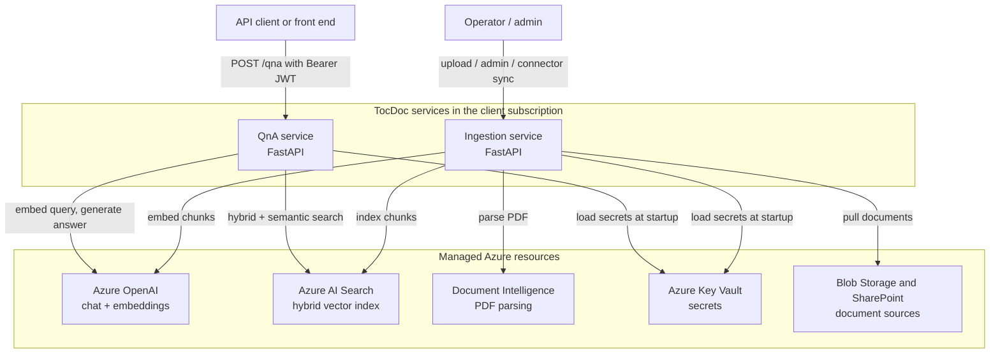
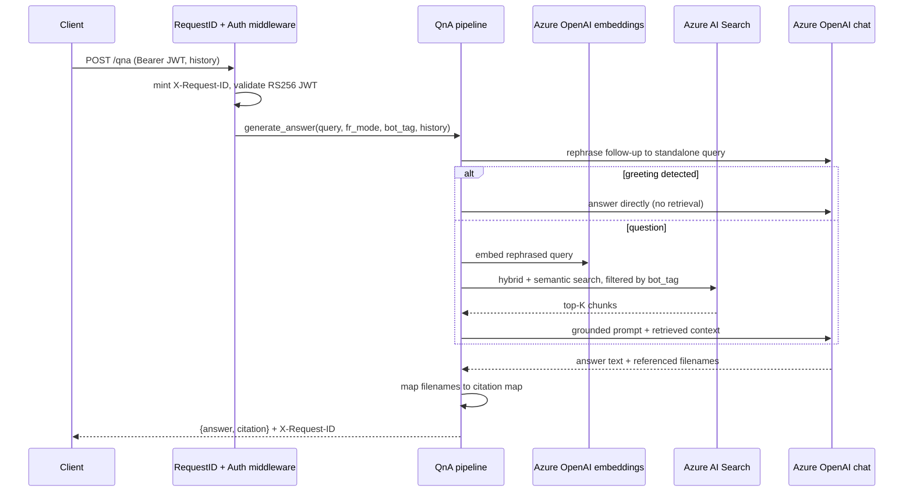
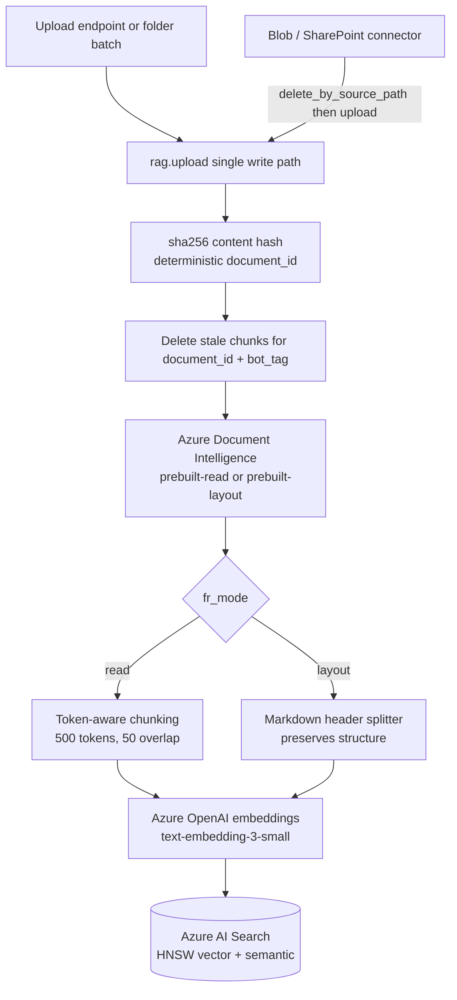

# TocDoc — Architecture Overview

> A single-read tour of the TocDoc enterprise RAG platform: what it is, how a
> request flows, how documents are ingested, how tenants stay isolated, and
> where the product is on its roadmap. Claims here are grounded in the source
> tree; file references point at the code that backs each statement.

---

## What it is

TocDoc is a **multi-tenant, document-grounded Retrieval-Augmented Generation
(RAG) platform** for enterprise Q&A over PDF corpora. It answers natural-language
questions with **cited, grounded responses** — the model is constrained to the
retrieved knowledge base rather than its pre-training.

Two design commitments shape everything below:

- **Deployed into the client's own Azure subscription.** TocDoc is not a shared
  SaaS. Each client runs the services in their own resource group against their
  own Azure OpenAI, AI Search, Document Intelligence, and Key Vault instances.
  Infrastructure ships as Bicep (`infra/main.bicep`) targeting Azure Container
  Apps.
- **`bot_tag` tenant isolation.** Every indexed chunk carries a `bot_tag`, and
  every retrieval query filters on it. One index can serve many tenants without
  cross-tenant document bleed.

The system is split into two independently deployable services:

| Service | Responsibility | Entry point |
|---|---|---|
| **Ingestion** | Parse PDFs → chunk → embed → index into Azure AI Search; admin + connector control plane | `services/ingestion/app.py` → `custom_rag.py` |
| **QnA** | Authenticate → retrieve → rephrase → answer → return structured citations | `services/qna/app.py` → `src/pipeline/qna_pipeline.py` |

Both are stateless FastAPI apps, containerized, and horizontally scalable.

---

## System context

TocDoc orchestrates a small set of managed Azure services. Clients call the two
HTTP services; those services call Azure OpenAI, AI Search, Document
Intelligence, and Key Vault. No state lives in the services themselves.

---

## QnA request flow

A QnA request authenticates, optionally rephrases a follow-up into a
standalone question, retrieves with a tenant-scoped hybrid query, generates a
grounded answer, and returns a structured citation map. Orchestration lives in
`generate_answer()` (`services/qna/src/pipeline/qna_pipeline.py`).

Key properties of this path:

- **Auth first.** `auth_middleware` (`src/core/auth.py`) validates the Azure AD
  Bearer token cryptographically via JWKS-backed **RS256** before the handler
  runs. `/health`, CORS preflight, and Swagger assets bypass auth.
- **Greeting short-circuit.** A conversational turn (detected during rephrasal)
  skips retrieval and answers directly — no wasted embed/search calls.
- **Tenant-scoped retrieval.** `perform_search` (`src/services/search_service.py`)
  rejects an empty `bot_tag` and builds an OData filter on `bot_tag` + `fr_tag`,
  so retrieval can only ever see the calling tenant's chunks.
- **Hybrid + optional semantic rerank.** Every query combines full-text (BM25)
  and vector KNN. When `AZURE_SEARCH_SEMANTIC_CONFIG` is set, an L2 semantic
  rerank layers on top; on a Search tier that does not support it, the call
  falls back to plain hybrid rather than failing.
- **Request-scoped state.** Conversation history and `bot_tag` are passed
  explicitly as parameters — there is no module-level mutable request state, so
  concurrent requests cannot contaminate each other.

---

## Ingestion flow

Ingestion is the **single write path** into the index:
`rag.upload(...)` in `services/ingestion/custom_rag.py`. Whether a document
arrives via the `/upload` endpoint or a connector, it routes through this one
function, so every indexing invariant is enforced in exactly one place.

The pipeline:

1. **Receive bytes** — from an upload, a folder batch, or a connector fetch.
2. **Deterministic document ID** — `document_id = sha256(content)[:16]`.
   Re-ingesting identical bytes is idempotent: stale chunks for
   `(document_id, bot_tag)` are deleted before upsert.
3. **Parse** — Azure Document Intelligence (`prebuilt-read` or `prebuilt-layout`).
4. **Chunk** — `read` mode uses **token-aware** chunking (tiktoken
   `cl100k_base`, 500-token windows, 50-token overlap); `layout` mode uses
   header-based Markdown splitting that preserves document structure.
5. **Deterministic chunk IDs** — `id = f"{bot_tag}_{document_id}_{fr_mode}_{i:05d}"`,
   so the same document always maps to the same chunk keys.
6. **Embed** — Azure OpenAI `text-embedding-3-small` (1536 dims).
7. **Index** — `merge_or_upload_documents` into Azure AI Search (HNSW vector +
   semantic config), stamping `bot_tag`, `fr_tag`, `source_type`, `source_path`,
   and `ingestion_timestamp` on every chunk.

Each stage emits a structured `log_event` (`document_parsed`,
`chunking_completed`, `embeddings_completed`, `index_upsert_completed`) so a run
is fully traceable by `request_id`.

---

## Multi-tenancy & security

The P0 hardening phase (8/8 shipped) established the security posture. The
highlights:

- **`bot_tag` tenant isolation (P0-2).** `perform_search` rejects an empty or
  whitespace `bot_tag` before any call and builds the search filter from an
  OData-escaped value (`search_service.py`). The pipeline raises if `bot_tag`
  is missing. Isolation is enforced at the retrieval layer, not by convention.
- **RS256 JWT validation (P0-1).** `validate_token` (`src/core/token_validator.py`)
  performs full cryptographic signature verification against the Azure AD JWKS
  endpoint. The auth middleware never logs the token value; failures are
  classified into coarse, safe labels (`expired_token`, `invalid_issuer`,
  `jwks_unavailable`, …) for observability.
- **Structured error envelope + X-Request-ID (P0-6).** Every 4xx/5xx returns the
  same shape — `{ "error": { "code", "message", "request_id", "errors?" } }` —
  with `X-Request-ID` in both the body and the response header
  (`src/core/errors.py`, mirrored in `services/ingestion/errors.py`). Raw
  exception text is never leaked to clients. A catch-all handler guarantees even
  unhandled exceptions produce an enveloped 500.
- **Key Vault secrets (P0-7).** Secrets load at startup; config reads canonical
  `UPPER_SNAKE` env vars (with a legacy dual-read shim) mapped to hyphenated Key
  Vault secret names (`src/config/config.py`, `infra/main.bicep`). No secrets in
  application code or in the repo.
- **No secrets in the repo.** CI runs `bandit` static analysis on every change;
  connector `source_path` strings are normalized to reject any credential- or
  SAS-bearing URI so secrets never reach a log line or an admin response.

The control plane uses a separate guard: admin and connector-sync endpoints sit
behind `require_admin_token` (an `X-Admin-Token` constant-time compare),
distinct from the QnA AAD JWT path.

A 2026 security audit drove a remediation pass (all 36 findings fixed on `main`):

- **Within-tenant workspace isolation is fail-closed by default** —
  `QNA_ENFORCE_TENANT_BINDING` defaults ON, binding the request `bot_tag` to the
  caller's token tenant (`tid`) via a configured allow-list
  (`src/core/tenant_binding.py`).
- **`/upload` now requires `X-Admin-Token`**, its `bot_tag` is pattern-validated
  and OData-escaped at the sink, and filesystem inputs are realpath-contained.
- **Application-level rate limiting** (429 + `Retry-After`) on `/qna` and
  `/upload`; outbound Azure/LLM calls carry timeouts.
- **JWKS negative-caching** guards against unknown-`kid` refetch DoS, and logs
  carry metadata only (no queries, answers, history, tokens, or document text).

---

## Operability

TocDoc is built to be run, not just demoed:

- **Admin API** (`services/ingestion/admin/`) — read-only document/index/tenant
  inspection plus destructive operations (delete-document, delete-tenant with
  confirmation, reindex stub). All routes are `bot_tag`-scoped, paginated, and
  OData-escaped.
- **Structured observability** (`observability.py` in both services) —
  `RequestIDMiddleware` mints/propagates a correlation ID on every request;
  `log_event` emits single-line JSON events that always carry `request_id`,
  drop `None` fields, and truncate string values to guard against logging full
  answers or document content. Secrets, JWTs, and raw chunk text are never
  logged.
- **Connector sync + run status** — operator-triggered Blob and SharePoint
  syncs run as in-stack background tasks (so they inherit the error envelope and
  request-ID middleware), each tracked by a `run_id` queryable via
  `GET /admin/connectors/runs/{run_id}` (`connectors/run_status.py`).
- **Deployment validation** — `scripts/validate_deployment.sh` runs post-deploy
  checks (resource existence, Container App health probes, Key Vault wiring) and
  is shellcheck-clean under the CI gate.

---

## Quality & supply chain

Quality is enforced by a production CI gate (`.github/workflows/ci.yml`) that
runs on every PR and push to `main`:

| Gate | Tool | Scope |
|---|---|---|
| Lint + format | `ruff` | qna, ingestion, SDK, eval |
| Security (AST) | `bandit` | qna, ingestion (test dirs excluded) |
| Dependency CVEs | `pip-audit` | per service — **hard gate** (documented allowlist) |
| IaC | `az bicep build` | `infra/main.bicep` compiles to ARM |
| Shell | `shellcheck` | `scripts/*.sh` |
| Tests + coverage | `pytest` + `pytest-cov` | matrix over {qna, ingestion} |
| SDK tests | `pytest` | `clients/python` (mocked HTTP) |
| Eval tests | `pytest` | `eval/` RAGAS harness (mocked, **hard gate**) |

Supporting practices:

- **Dependabot** (`.github/dependabot.yml`) — weekly grouped updates across both
  services, the SDK, the eval harness, GitHub Actions, and Docker base images.
  Fragile ecosystems (`langchain*`, the FastAPI/Starlette stack, `azure-*`) are
  grouped so version-locked families move together.
- **RAGAS evaluation harness** (`eval/`, P4-2) — scores the real QnA pipeline's
  answers against a benchmark on `faithfulness`, `answer_relevancy`, and
  `context_precision`. It imports the QnA code read-only and keeps the heavy
  RAGAS/`datasets` dependencies out of the QnA runtime image. The shipped
  benchmark is synthetic and neutral — meant to exercise the harness, not to
  document product behavior.

> Update: both earlier follow-ups are closed — `pip-audit` is now a **hard gate**
> (with a small documented allowlist) and coverage is **floor-gated**
> (`--cov-fail-under=60`). CI also runs **CodeQL** (`analyze (python)`),
> **`helm lint`**, and a **`test (teams-bot)`** job. The runtime is **Python
> 3.12** and both services run **langchain 1.x** — the previously deferred
> dependency cascade is resolved.

---

## Roadmap & design decisions

Two phases are designed-and-decided ahead of implementation; their ADRs live
under `docs/architect_phase_2/`.

### P2 — Retrieval quality (in progress)

- **Semantic reranking (shipped).** Config-gated L2 semantic rerank over the
  hybrid query, with graceful fallback on unsupported Search tiers
  (`search_service.py`).
- **Typed `CitationMap` success contract (shipped).** The QnA success response
  is now typed (`src/core/responses.py`), the shared enabler for the SDK and
  RAGAS context scoring.
- **Page-level citations (pending).** Blocked on deriving `page_number` during
  ingestion (a read-mode chunking change requiring a reindex), not on schema.
  Decisions are recorded in `docs/agent_plan/07_P2_P4_REFRESHED_PLAN.md` and
  `docs/agent_plan/03_P2_DIFFERENTIATION.md` — there is no standalone ADR file.

### P3 — Agentic layer (built, dark)

ADR: [`docs/architect_phase_2/07_P3_LANGGRAPH_ADR.md`](architect_phase_2/07_P3_LANGGRAPH_ADR.md).
A LangGraph `StateGraph` wraps the existing pipeline behind a **default-OFF
feature flag** (`QNA_AGENT_ENABLED`, with per-node `QNA_AGENT_MAP_REDUCE` /
`QNA_AGENT_REACT` / `QNA_AGENT_VERIFY`), preserving the byte-for-byte `/qna`
contract until enabled. The scaffold, structured-output router, map-reduce
summarizer, ReAct multi-hop node, and self-critique verifier are all **merged to
`main` and inert**, pending architect sign-off to enable. The shape:

- A **classifier node with conditional edges** routes each query to one of
  three strategies — standard, map-reduce summarizer, or a ReAct multi-hop
  agent — converging on a single **self-critique verifier** before `END`.
- **Tenant isolation is preserved by construction:** `bot_tag` flows through
  graph state into the unchanged `perform_search`, and is **never exposed to the
  LLM** — tool schemas carry only query-shaped args, with `bot_tag`/`fr_mode`
  bound in tool closures.
- **Concurrency is code-grounded:** because the Azure OpenAI client is
  synchronous behind a small thread pool, any fan-out uses a bounded executor
  with a semaphore — never a bare `asyncio.gather` over the sync client.
- Conversation memory (Cosmos-backed) and SSE streaming are scoped as
  independent, separately-flagged increments.

### P4 — Platform completeness

| Item | State | Reference |
|---|---|---|
| **Python client SDK (P4-4)** | **Shipped** — sync + async, `tocdoc` CLI, optional LangChain retriever, SSE streaming | `clients/python` |
| **RAGAS evaluation (P4-2)** | **Shipped** — + baseline/threshold gating + continuous-eval trend reports | `eval/` |
| **Microsoft Teams bot (P4-1)** | **Shipped** — Bot Framework adapter, unspoofable server-side `bot_tag`, inbound JWT auth | `services/teams-bot/` (ADR 10) |
| **Helm chart for AKS (P4-3)** | **Shipped** — + NetworkPolicy / ServiceMonitor / HA toggles | `charts/tocdoc/` |
| **Terraform module** | **Shipped** — azurerm mirror of the Bicep | `infra/terraform/` |
| **SSE answer streaming** | **Shipped** — `POST /qna/stream` + SDK `stream_ask` | `services/qna`, `clients/python` |
| **Multi-format ingestion** | **Shipped** — DOCX/PPTX/HTML/MD/TXT + PDF | `services/ingestion/` |

The Teams bot is a thin adapter over the QnA HTTP API: Teams identity → `bot_tag`
derived **server-side** from the verified tenant id (never from message text),
inbound Bot Framework JWT validated, citations rendered as adaptive cards.

### Connectors — decided & shipped (P1-3)

ADR: [`docs/architect_phase_2/08_P1_3_CONNECTORS_ADR.md`](architect_phase_2/08_P1_3_CONNECTORS_ADR.md).
A connector is a **thin enumerator + downloader**, not a subsystem: it routes
every document through `upload()` and never hashes content, mints chunk IDs,
chunks, embeds, or writes the index directly — so the P0-4/P0-5 determinism
guarantees stay enforced in one place. The sync driver runs as an **in-stack
background task** behind `require_admin_token`, inheriting the P0-6 error
envelope and `X-Request-ID` middleware. Edited-file cleanup uses
`delete_by_source_path` before re-upload, since a content edit changes the
`document_id` and would otherwise orphan old chunks.

---

## Project maturity

A concise, honest status snapshot. "Shipped" means merged to `main`; "Designed"
means an approved ADR/spec with implementation pending; "Planned" means scoped
but not yet designed in detail.

| Capability | Status | Evidence |
|---|---|---|
| RS256 JWT validation | **Shipped** | `auth.py`, `token_validator.py` (P0-1) |
| `bot_tag` tenant isolation | **Shipped** | `search_service.py`, `qna_pipeline.py` (P0-2) |
| Request-scoped pipeline (no global state) | **Shipped** | `qna_pipeline.py` (P0-3) |
| Deterministic chunk IDs + token-aware chunking | **Shipped** | `custom_rag.py` (P0-4, P0-5) |
| Structured error envelope + X-Request-ID | **Shipped** | `core/errors.py`, ingestion `errors.py` (P0-6) |
| Key Vault secrets + canonical config | **Shipped** | `config.py`, `infra/main.bicep` (P0-7) |
| Production-safe CORS / logging / containers | **Shipped** | `app.py`, Dockerfiles (P0-8) |
| Structured observability (request + stage events) | **Shipped** | `observability.py` (P1-1) |
| Admin API (read + destructive, scoped) | **Shipped** | `admin/` (P1-2) |
| Blob + SharePoint connectors + run status | **Shipped** | `connectors/` (P1-3) |
| Bicep IaC + GitHub Actions CI gate | **Shipped** | `infra/`, `ci.yml` (P1-4, P1-5) |
| Semantic reranking (config-gated) | **Shipped** | `search_service.py` (P2-1) |
| Typed `CitationMap` success contract | **Shipped** | `core/responses.py` (P2-1) |
| Python client SDK (+CLI, LangChain, streaming) | **Shipped** | `clients/python` (P4-4) |
| RAGAS + continuous-eval harness | **Shipped** | `eval/` (P4-2) |
| Microsoft Teams bot | **Shipped** | `services/teams-bot/` (P4-1) |
| Helm chart (AKS) + Terraform module | **Shipped** | `charts/tocdoc/`, `infra/terraform/` |
| SSE answer streaming (`/qna/stream`) | **Shipped** | `services/qna`, `clients/python` |
| Multi-format ingestion (DOCX/PPTX/HTML/MD/TXT) | **Shipped** | `services/ingestion/` |
| Runtime: Python 3.12 + langchain 1.x | **Shipped** | both services |
| Security-audit remediation (36 findings) | **Shipped** | hardening PRs on `main` |
| Fail-closed tenant binding + `/upload` auth + rate limiting | **Shipped** | `tenant_binding.py`, `app.py` |
| Agentic LangGraph layer (router/map-reduce/ReAct/verifier) | **Built, dark** | `src/agents/` (P3) |
| Page-level citations | **Designed / pending reindex** | P2 differentiation + refreshed plan |

For the authoritative, continuously-updated status, see
[`docs/agent_plan/00_MASTER_TRACKER.md`](agent_plan/00_MASTER_TRACKER.md).
