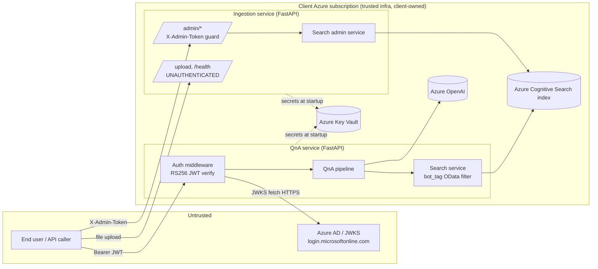

# Threat Model

This document describes the **security architecture** of the system: where the
trust boundaries are, what we are protecting, the threats we have reasoned
about, the mitigations that exist **in code today**, and the residual risks /
hardening work that is **not** yet done.

It complements [`SECURITY.md`](../SECURITY.md), which is the *policy* (how to
report a vulnerability, supported versions, secret-handling rules). This is the
*architecture* — grounded in the actual code, with file/line citations so the
claims can be checked.

A deliberate discipline runs through this document: **enforced-in-code** is kept
strictly separate from **designed-but-not-shipped**. Where a control is planned
but not implemented, it is labelled as such and lives in
[Planned controls](#planned-controls-not-yet-shipped) or
[Residual risks](#residual-risks--hardening-backlog), never in
[Mitigations in place](#threats-mitigations-and-residual-risk).

---

## Deployment model

The product is two services — **ingestion** and **QnA** — deployed **into each
client's own Azure subscription / resource group**. The client owns all data,
compute, and Azure resources (Azure OpenAI, Cognitive Search, Document
Intelligence, Key Vault). There is no shared multi-tenant control plane operated
by the vendor.

A single deployment is **single Azure-AD-tenant**: it is configured with one
concrete `AZURE_TENANT_ID`, and the whole cross-tenant guarantee rests on that
(see [T2](#t2-cross-tenant-data-access) and its precondition). Within one
deployment, the index can hold several logical **workspaces** distinguished by a
`bot_tag` value (e.g. an HR workspace and a legal workspace for the same client).

---

## Trust boundaries

Boundaries that matter for this model:

1. **Internet → QnA service.** Every authenticated request crosses the Azure AD
   JWT boundary. This is the primary authentication boundary.
2. **Internet → ingestion service.** `/admin/*` crosses the interim admin-token
   boundary. `/upload` and `/health` are **unauthenticated** today (see
   [T1](#t1-spoofing--unauthenticated-access)).
3. **QnA service → Azure AD.** Outbound HTTPS to the JWKS endpoint to fetch
   signing keys. Enforced HTTPS-only (`token_validator.py:48`).
4. **Service → Azure Key Vault.** Secrets are pulled at startup, never stored in
   the repo.
5. **Within a deployment: workspace ↔ workspace (`bot_tag`).** This is a *logical*
   boundary inside one tenant's index. It is **not** enforced in code on the QnA
   request path today (see [T2b](#t2b-cross-workspace-within-tenant-access) and
   [residual risk R1](#r1-within-tenant-workspace-separation-is-not-enforced-in-code)).

---

## Assets

| Asset | Why it matters |
| --- | --- |
| Client document content & embeddings (in Cognitive Search) | The core confidential data. Cross-tenant or cross-workspace leakage is the worst case. |
| Azure AD identity / the user email claim | Drives audit, billing, and authorization decisions; spoofing it is a foothold. |
| Service secrets (Azure OpenAI key, Search key, SP client secret, admin token) | Compromise gives direct access to the data plane. |
| Request integrity (the `bot_tag` scope) | The scope that decides which workspace's documents a query can read. |
| Audit / correlation trail (`X-Request-ID`, `request.state.email`) | Needed to investigate incidents; must not itself leak sensitive content. |

---

## Threats, mitigations, and residual risk

The threats below are organised roughly along STRIDE lines: **S**poofing,
cross-tenant / cross-workspace access (Elevation / Information disclosure),
**I**njection (Tampering), secret leakage (Information disclosure), and token
replay (Spoofing). Each lists the mitigation **in code** and, where relevant,
the honest gap.

### T1. Spoofing / unauthenticated access

**Threat.** An attacker calls an endpoint without (or with a forged) identity.

**Mitigations in place.**

- **QnA: RS256 JWT validation on every authenticated request.** The auth
  middleware (`services/qna/src/core/auth.py`) requires
  `Authorization: Bearer <token>`, then verifies the token cryptographically.
  `validate_token` (`services/qna/src/core/token_validator.py:100`) reads the
  `kid` from the header only to *select* a public key (never to trust it),
  fetches the matching JWKS key, and decodes with **full signature verification
  on** using `algorithms=["RS256"]` (`token_validator.py:193-200`). There is no
  `verify=False` path.
- **Email-claim required.** Even a validly-signed token is rejected **401** if it
  carries no `upn` / `preferred_username` / `email` claim
  (`auth.py:119-133`). This is what forces a *user* (delegated) token rather than
  an app-only token, keeping `request.state.email` meaningful for audit.
- **Fail-closed.** Any validation failure — malformed header, missing `kid`,
  unknown key, bad signature, wrong issuer/audience, expiry — raises
  `TokenValidationError` and returns an error envelope; nothing falls through to
  the handler (`auth.py:138-172`, `token_validator.py:129-208`). JWKS-unavailable
  is a **503**, not a bypass (`token_validator.py:62`).
- **Public routes are an explicit, narrow allowlist:** CORS preflight,
  `*/health`, and the Swagger asset paths only (`auth.py:83-88`).
- **Ingestion `/admin/*`: interim shared-secret guard.** `require_admin_token`
  (`services/ingestion/admin/auth.py`) compares the `X-Admin-Token` header to
  `ADMIN_API_TOKEN` using **constant-time** `secrets.compare_digest`
  (`auth.py:51-53`), refuses with **503** if no token is configured rather than
  bypassing auth (`auth.py:45-49`), and returns an identical **401** for both
  "missing" and "wrong" to avoid token enumeration (`auth.py:42-43, 51-57`).

**Residual.** `/upload` and `/health` on the ingestion service are
**unauthenticated** by design today (admin/auth.py docstring, lines 14-17). The
admin token is an **interim** static shared secret; the intended end state is the
same Azure AD JWT mechanism as QnA (admin/auth.py docstring, lines 9-10). See
[R2](#r2-ingestion-upload-is-unauthenticated-admin-auth-is-an-interim-shared-secret).

### T2. Cross-tenant data access

**Threat.** A user from tenant B retrieves tenant A's documents.

**Mitigation in place — the issuer pin (the cross-tenant spine).**
`token_validator.py:181-190` derives the *expected* issuer from the configured
`settings.AZURE_TENANT_ID` — accepting only the v1 (`https://sts.windows.net/{tenant}/`)
or v2 (`https://login.microsoftonline.com/{tenant}/v2.0`) form for **that**
tenant — and rejects any other issuer with `TokenValidationError` → **401**. A
token minted by any other tenant fails issuer equality and is rejected **before
any search runs**. Combined with the per-deployment model, tenant B's documents
are not even present in tenant A's index. This control **fails closed**.

**Precondition (honest caveat).** This guarantee holds **only if
`AZURE_TENANT_ID` is configured to a concrete tenant GUID.** If it were ever set
to `common` or `organizations`, the issuer pin would no longer bind to one
tenant. ADR 10 (lines 197-201) recommends a startup assertion that rejects
`common`/`organizations`; **that assertion is not implemented today** (no such
check exists in `services/qna/src/config/config.py`). So the accurate statement
is: *cross-tenant isolation is enforced in code, provided the operator
configures a concrete GUID — there is currently no guard that makes a
misconfiguration loud.* See
[R3](#r3-no-startup-assertion-that-azure_tenant_id-is-a-concrete-guid).

### T2b. Cross-workspace (within-tenant) access

**Threat.** An authenticated user within tenant A requests workspace
`client_a_legal` while only entitled to `client_a_hr`.

**What is in place.** `bot_tag` is threaded explicitly through the pipeline and
becomes part of the OData filter
`fr_tag eq '<fr>' and bot_tag eq '<bot_tag>'`
(`services/qna/src/services/search_service.py:110-112`). An **empty / blank
`bot_tag` is rejected** with `ValueError` *before any search runs*
(`search_service.py:47-48`). The `bot_tag` is **state-only and never made
LLM-visible** (`services/qna/src/agents/state.py:36`), so it cannot be exfiltrated
through model output.

**The honest gap.** On the QnA request path, `bot_tag` flows from the request
**body untouched** into the filter — QnA does **not** bind the request-body
`bot_tag` to the token's `tid`. So an authenticated user in a tenant can supply
*another* workspace's `bot_tag` and the filter will happily scope to it. The
empty-check guards against *missing* scope, not against *wrong* scope. This is
the single most important residual in this model — see
[R1](#r1-within-tenant-workspace-separation-is-not-enforced-in-code). It is
called out directly in ADR 10 (lines 248-256, 270-273).

### T3. Injection (OData filter injection)

**Threat.** A crafted `bot_tag` / `document_id` / `fr_mode` breaks out of the
filter literal and reads or alters the query scope.

**Mitigations in place.**

- **Admin layer: regex validation + escaping (defense in depth).** Admin routes
  validate path/query parameters against strict patterns *before* the service
  layer runs — `BOT_TAG_PATTERN = ^[A-Za-z0-9_-]{1,128}$`,
  `DOCUMENT_ID_PATTERN`, `RUN_ID_PATTERN`
  (`services/ingestion/admin/routes.py:63-68`, applied at lines 101, 132, 136,
  174, 208, 212, 247, 295, 299). These reject quotes, spaces, semicolons, OData
  operators, path traversal, and over-long values, returning a clean **422/400**.
  The service layer then *additionally* escapes single quotes via `_escape_odata`
  (`'` → `''`, `search_admin_service.py:87-95`) as a second line of defence "in
  case a future caller bypasses validation."
- **QnA search layer: quote escaping.** `search_service.py:110-111` escapes single
  quotes in both `bot_tag` and `fr_mode` before building the filter literal.
- **`fr_tag` is constrained at the ingestion connector boundary** to
  `^(read|layout)$` at the request model (ingestion `app.py:112`); QnA uses an
  internal `fr_mode` → `fr_tag` mapping rather than a free-form value.

**Residual — validation asymmetry.** The QnA `/qna` path applies **only**
quote-escaping to `bot_tag`; it has **no format/length regex** like the admin
routes do. A crafted or oversized `bot_tag` therefore does not get a clean 400 —
it is escaped, used, and simply returns zero results. ADR 10 (lines 135-141,
258-259) flags this and proposes adding `^[A-Za-z0-9_-]{1,128}$` validation on
the QnA path too. See
[R4](#r4-qna-bot_tag-is-quote-escaped-but-not-format-validated).

### T4. Secret leakage

**Threat.** Secrets end up in the repo, in logs, or in error responses.

**Mitigations in place.**

- **No secrets in the repo.** Secrets are loaded at runtime from **environment
  variables** and **Azure Key Vault** (`services/qna/src/config/config.py`, which
  pulls KV secrets via `DefaultAzureCredential` + `SecretClient` and rewrites them
  into `os.environ` under canonical names). `.env*` files are git-ignored
  (per `SECURITY.md`).
- **Structured error envelope never leaks exception text (P0-6).** Every 4xx/5xx
  is the `ErrorEnvelope` shape (`code` / `message` / `request_id`) built by
  `build_error_response` (`services/qna/src/core/errors.py`). The catch-all
  `unhandled_exception_handler` logs the full trace **server-side** but returns
  only a generic `"Internal server error"` — `str(exc)` is **never** sent to the
  client (`errors.py:302-336`). Auth middleware likewise never returns `str(e)`
  and never logs the token value, only a coarse `failure_type` label
  (`auth.py:27-47, 157-172`).
- **Logs avoid sensitive payloads.** The token value is never logged
  (`auth.py:111`); `_materialize` "never logs chunk content"
  (`search_service.py:162-171`); validation errors are truncated and the user
  `input` field is not echoed back (`errors.py:272-299`).
- **Admin select-lists are deliberately narrow** — they never select `content`
  or vector fields (`search_admin_service.py:38-61`), so admin responses cannot
  spill document text.

**Residual.** Dependency-CVE risk (a vulnerable transitive package) is only
**report-only** in CI today — see [R5](#r5-pip-audit-is-report-only-in-ci).

### T5. Token replay / forgery

**Threat.** A captured or forged token is replayed.

**Mitigations in place.**

- **Expiry is enforced** with a tight **10-second** clock-skew leeway
  (`token_validator.py:199`); expired tokens map to a distinct `expired_token`
  failure label and a 401 (`token_validator.py:201-202`, `auth.py:42-43`).
- **Audience pin.** `jwt.decode(..., audience=settings.AUDIENCE_ID)`
  (`auth.py:112-116`, `token_validator.py:197`) rejects tokens minted for a
  different audience.
- **Signature + issuer + JWKS rotation.** Forgery requires the tenant's private
  signing key. Key rotation is handled gracefully: on a `kid` cache miss the JWKS
  cache is cleared and refetched **once** (`token_validator.py:152-166`), and the
  cache has a 1h TTL (`token_validator.py:41, 80`).

**Residual.** There is no token denylist / `jti` tracking — a stolen, still-valid
token can be replayed within its lifetime. This is standard for stateless JWT
auth and is mitigated by short token lifetimes (an Azure AD configuration
concern, outside this code).

---

## Planned controls (not yet shipped)

These are **designed but not implemented**. They are documented here so the
intended end state is clear and so nobody mistakes them for current behaviour.

- **Teams bot unspoofable identity → `bot_tag` design (ADR 10 — DRAFT, "Not yet
  implemented", line 1).** The proposed Teams front end is a thin Bot Framework
  adapter deployed into the same client subscription. Its security spine: the
  inbound `Activity` is signed by Microsoft's Bot Connector (issuer
  `api.botframework.com`); the adapter validates that signature **before reading
  any field**, then **derives `bot_tag` server-side** from the signed,
  service-stamped `channelData.tenant.id` (or a conversation reference) — the user
  **never types, names, or supplies** a `bot_tag`. The outbound call to `/qna`
  uses a genuine Azure AD **user** token via **Teams SSO + On-Behalf-Of**, which
  reuses the *existing* QnA JWT contract unchanged. None of this exists in the
  codebase today.
- **QnA-side `tid` → permitted-set-of-`bot_tags` → 403 check (ADR 10, lines
  100-106, 318-320).** The proposed defence-in-depth fix for the
  [T2b](#t2b-cross-workspace-within-tenant-access) gap. Explicitly described in
  the ADR as "**new behavior, not shipped today**." It must bind a `tid` to a
  *permitted set* of `bot_tags` (not strict `tid == bot_tag`, which would reject
  legitimate multi-workspace clients).
- **`AZURE_TENANT_ID` concrete-GUID startup assertion (ADR 10, lines 197-201).**
  Proposed to make a `common`/`organizations` misconfiguration fail loudly at
  startup. Not implemented (see [R3](#r3-no-startup-assertion-that-azure_tenant_id-is-a-concrete-guid)).
- **QnA-side `bot_tag` format/length validation (ADR 10, lines 135-141).**
  Proposed to apply the admin routes' `^[A-Za-z0-9_-]{1,128}$` pattern on the QnA
  path too. Not implemented (see [R4](#r4-qna-bot_tag-is-quote-escaped-but-not-format-validated)).
- **Network-private `/qna` within the subscription (ADR 10, lines 193-196).** A
  deployment-level control to ensure only the adapter can reach `/qna`. This is an
  infrastructure-configuration concern, not enforced by the application code.

---

## Residual risks & hardening backlog

Ordered by priority.

### R1. Within-tenant workspace separation is not enforced in code

`bot_tag` is taken from the request body and used as-is in the OData filter; QnA
does not check that the caller's token (`tid`) is entitled to the requested
`bot_tag` ([T2b](#t2b-cross-workspace-within-tenant-access)). An authenticated
user in a tenant can therefore query any workspace in that tenant's index by
supplying its `bot_tag`. **Cross-*tenant* isolation is intact; within-tenant
*workspace* isolation is not.** Mitigation today is operational (don't expose
`/qna` to untrusted callers in a multi-workspace deployment). Fix: the planned
`tid` → permitted-set → 403 check, plus the planned network-private `/qna`.

### R2. Ingestion upload is unauthenticated; admin auth is an interim shared secret

`/upload` and `/health` accept unauthenticated requests; `/admin/*` is guarded by
a static `ADMIN_API_TOKEN` shared secret rather than Azure AD JWTs. Fix: move
`/admin/*` (and gate `/upload`) onto the same RS256 JWT mechanism as QnA.

### R3. No startup assertion that `AZURE_TENANT_ID` is a concrete GUID

The cross-tenant guarantee ([T2](#t2-cross-tenant-data-access)) depends on the
operator configuring a concrete tenant GUID. A `common`/`organizations`
misconfiguration would silently weaken the issuer pin. There is no guard to make
this loud. Fix: add the ADR 10 startup assertion.

### R4. QnA `bot_tag` is quote-escaped but not format-validated

Unlike the admin routes, the QnA path applies no length/format regex to
`bot_tag` ([T3](#t3-injection-odata-filter-injection)). The single-quote escaping
prevents filter break-out, so this is **defence-in-depth / input hygiene** rather
than an open injection hole, but a crafted/oversized value returns a confusing
empty result instead of a clean 400. Fix: apply `^[A-Za-z0-9_-]{1,128}$` on the
QnA path.

### R5. `pip-audit` is report-only in CI

The CI security job runs `bandit` (gating) plus `pip-audit` on both services'
requirements, but `pip-audit` is **`continue-on-error: true`** — it prints
findings but does not fail the build (`.github/workflows`, pip-audit steps).
Dependency CVEs are visible but not enforced. Fix: graduate `pip-audit` to a
gating check once the baseline is clean.

### R6. No token revocation / replay window

Stateless JWT auth has an inherent replay window until expiry
([T5](#t5-token-replay--forgery)). Mitigated by short token lifetimes configured
in Azure AD; no application-side `jti` denylist exists.

---

## Summary

The strongest controls are **existing code**: RS256 JWT verification with a
fail-closed issuer pin (cross-tenant isolation), the email-claim requirement, the
P0-6 error envelope that never leaks exception text, constant-time admin-token
comparison, and layered OData-injection defence in the admin path. The most
important honest gaps are **within-tenant workspace isolation** (R1) and the
**unauthenticated ingestion upload / interim admin token** (R2). The Teams-bot
identity design and the QnA-side `tid`→`bot_tag` authorization check are **planned,
not shipped** — and are documented as such so this model stays honest.
